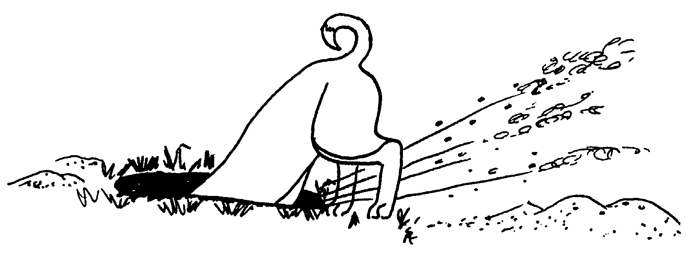

# Living With a Basenji

## \index{socialization}Socialization

_**Acquainting your pup with new situations:**_ A young pup is continually learning about his new environment.  Every situation in which he is placed, every person he meets, every pleasant or unpleasant incident in his early life can have a long lasting effect on him.

Dogs must be handled by people at an early age if they are to develop into good companions.  Dogs that are uncomfortable with humans are difficult to train, often develop into fear biters, adapt poorly with children and may frequently run away. Puppies who have very little early human contact can grow to be extremely shy dogs.  Bringing a shy dog out is a difficult, painstaking process that isn't always successful.

Expose your puppy to various types of people, i.e., boys, girls, men, women, youngsters and oldsters.

Expose him to as many new situations as possible, but take care he has a good experience.

Expose your puppy to new terrain (stairs, tall grass, loose sand, gravel, small obstacles, etc.) Always start with a simple problem and gradually make it more difficult, but do not exceed the pup's abilities.  Make sure the pup succeeds in the tasks.

Get him used to being in crowds or places where there is a lot of activity.  Don't hesitate to use a special treat to distract him.

Accustom your puppy to riding in the car by going for short rides.

Guard against isolating your pup for prolonged periods of time.  \index{digging}Digging, \index{chewing}chewing and scratching often occur because the pup is kept by himself. Puppies are social animals and need social contact for proper development.

If your pup tends to be somewhat shy, make sure any discipline is not excessive.  However, it is very important not to baby a shy pup, as this will only reinforce his shyness.  Encourage him to overcome shyness by going forward, not retreating. Praise and treat him for going forward and making progress.

With your supervision, encourage him to explore his new home. Then take him to your friends' homes.  The sooner he checks everything out, the more comfortable he will be.  Encourage him to investigate new objects and praise him when he does. However, make sure his first experience isn't frightening. Do not give the puppy the run of the house.

Don't use isolation as a form of discipline. Puppies should be trained to be comfortable when alone.

It isn't necessary to introduce your new pup to everything the first several days.  Do it gradually so that he is not overwhelmed.  As he learns about new sounds and situations, he will discover that they really won't harm him and will become comfortable when he meets them again.

_**How to remain the "leader of the pack"**_

Your basenji, along with all other canines, is a social pack animal.  As young puppies, littermates begin interacting socially with each other, exhibiting "pushy" or dominant behavior.  After repeated playful fighting, the pups learn when to act pushy and when to back down.  Although capable of both behaviors, your pup's natural tendency is to go as far as possible within his social order---to push his way into a leadership position.  It is this tendency you must control early if you want to raise a good family pet.  Your puppy will attempt to interact with people just as he did with his littermates.  In such interaction or play, you and other family members should assume a leadership role and discourage pushy behavior in the pup.

Recognizing \index{dominant}dominant and \index{submissive}submissive behavior: \index{dominant}Dominant signals and behavior include \index{hackles}hackles up, standing up straight and erect during greeting, curling lips to expose teeth, mounting behavior, prolonged direct eye contact, nipping your skin or clothing, or mouthing your hands, resistance to the removal of possessed objects, stealing food in your presence, or snarling and/or growling at people.

Subordinate signals include ears back, head lowered, body lowered and \index{tail}tail down and wagging vigorously during greeting; lying on side while exposing groin region, ears back and tail tucked under (usually occurs during times of high social tension such as a discipline situation); licking hands or face.

The following are guidelines to insure that you and other family members assume and retain the leadership relationship with your dog.  Beginning at an early age will insure that your puppy will learn appropriate behavior quickly and will help eliminate problem behavior later on.

Immediately discourage your pup's pushy behavior toward you or others.  Use only enough unpleasant discipline to get the job done.  Then follow with plenty of praise.

Be _**consistent**_.  Each and every time the pup displays one of the dominant or pushy signals, you or any other family member should follow through with discipline.

Don't unconsciously encourage him to act pushy.  Never roughhouse so that he thinks he's won (or dominated you).

Never chase your dog (Leaders don't chase).

Never \index{discipline}discipline your puppy for misbehavior unless you catch him in the act.  Use only enough discipline to make him immediately stop what he's doing, then praise him for stopping.

Never allow your puppy to nip or mouth you, even in play. Let the puppy know with the muzzle or neck scruff correction that this behavior is not allowed.  (See article on \index{discipline}Discipline.)

Being the leader does not mean that you need to be cruel or beat your dog into minding.  Your basenji is not dumb. You must earn his respect by becoming a fair, just, and consistent leader.

The following exercises will help you teach your puppy that you are in control of him physically. The pup doesn't learn about social relationships through some intellectual process, but on a physical level.  He must learn that you have the power to handle him and that handling doesn't lead to physical harm.  Then he can trust you and at the same time is your subordinate.

While seated on the floor, pick up the pup with both hands by holding him underneath his shoulder area so that he is facing you. Hold him at arm's length and look directly into his eye.  _**Do not be the first to look away.**_  If he struggles, follow with a raised voice and quick shake.  When he is quiet, talk to him in a soft, pleasant voice. Continue your eye contact.  Maintain this position for 30 to 90 seconds (vary time). Repeat this exercise until he no longer struggles.

Place the pup on his side on the floor, using one hand to hold him by the neck scruff and stroke his tummy with the other.  Talk to him in a soft, pleasant voice when he is quiet.  Do not allow him to struggle, nip or mouth your hands.  If he tries, raise your voice and shake him firmly by the \index{neck scruff correction}scruff of the neck, as his mother would do.  Praise him lavishly when he stops.

When he's quiet, place your fingers around his muzzle, open his mouth, handle his feet, etc. Praise him for tolerating the handling.

These exercises should be performed regularly during early development and can be started when you first meet the puppy.  The more dominant the behavior your puppy demonstrates, the more you should emphasize these exercises.

As your basenji goes through the juvenile stage and moves toward maturity, he may again periodically test your leadership. Most pack members are subordinate.  _**You will not "break his spirit"**_ or inhibit his development into a normal, healthy basenji. Rather, you are giving him a defined position in your family, behavior guidelines to follow, and a sense of trust in you, his leader.

## \index{discipline}Discipline

Teaching your puppy right from wrong is an important aspect of raising a basenji.  People often mistakenly assume that a dog learns about his world much like a child would.  But, in fact, he learns differently than a child.  He relies more heavily on his hearing and smelling abilities, his more pronounced inherited capabilities and, more important, he does not have a grammatical language.  That is why we cannot directly communicate with him as we could a child.  We cannot sit down and reason with him and tell him what we expect of him.

A dog learns by doing.  His actions produce specific results. If he finds the results pleasing, he will tend to repeat the action.  If he finds the results unpleasant, he will tend to not repeat the action that produced them.

There are two techniques used to mold your puppy's behavior which take the above principles into account.  You should become familiar with these and use them to your best advantage.  These techniques are called _\index{positive reinforcement}Positive Reinforcement_ and _\index{negative reinforcement}Negative Reinforcement_.  Positive Reinforcement is used to establish behavior that the dog would not ordinarily do on his own.  Negative Reinforcement is used to discourage behavior that you find unacceptable or undesirable.

\index{positive reinforcement}Positive Reinforcement includes exuberant, enthusiastic praise, food and treats, or play.  The time to use this praise is any time your basenji demonstrates behavior you want to reinforce. Use lots of praise as you physically guide him through the behavior, or as you coax him into the position with food.  Also use lots of praise when he does the desired behavior on his own.

Examples of when to use \index{positive reinforcement}Positive Reinforcement include: any training such as sit, or down; any dog tricks; teaching your dog to come when called; teaching your dog to stack; going into a crate; relieving himself in the spot you choose; \index{chewing}chewing on his own toy; any behavior you want to encourage.

\index{negative reinforcement}Negative Reinforcement can be Verbal or Physical and should be used to stop any unwanted behavior _**as it happens**_ such as: Relieving in the house; \index{chewing}chewing on objects "off limits"; stealing food; jumping up; aggression; getting on furniture; chasing the cat; any behavior you wish to discourage.

A Verbal correction should be spoken loud and as if you really mean it.  Try to make a distinction in your voice between your _No!!!_  and any other conversation you have with your basenji.  In other words, try not to speak in a monotone (in praise and correction) or direct your correction as a dare or a question (No-o???).

A loud noise may also work to correct the misbehavior. Try slapping your hand down to make a loud noise along with a growly _**NO!!**_ to intimidate your basenji into stopping the behavior.   The next type of correction is physical.  The \index{muzzle correction}muzzle correction is done by firmly grasping his muzzle in your hand (without squeezing) and telling him in no uncertain terms _**"No, Bad Dog."**_ (Here again, try to sound intimidating.)  The \index{neck scruff correction}neck scruff correction is done by grasping the skin on the back or side of his neck and giving a firm shake (but not enough to lift him off the ground) while again giving the verbal correction.

These corrections need only last a moment or two.  Your dog won't understand a prolonged lecture about how bad he is.  Following a correction, give your dog something positive to do so you can praise him.  (Be forgiving.)

Another type of correction used when your dog is on the leash is the **Lead Pop**.  This is a quick jerk on the lead which tightens the training collar then is immediately released to a slack lead. When done correctly you should hear the "pop" of the collar tightening and pulling on a tight lead. You can use this correction with the commands, "No Sniff," "Leave It," or "No Pulling."

The timing of your praise or correction is important for your dog to make the connection between his behavior and your reaction. Reinforcement (positive or negative) must be during or immediately after the behavior to have the most impact. Reinforcement must be used constantly and consistently during the learning stages. (Even if you have to get up from the couch 10 times in 10 minutes to stop unwanted behavior.)  Dogs learn by repetition.  Every time you permit an incorrect response the dog is learning the incorrect response or learning that he doesn't always have to obey you.

The amount of reinforcement (positive or negative) required for each behavior is gradually diminished as that behavior becomes a conditioned response.  The more consistent you are with your reinforcement, the quicker this learning takes place.

Another influence on molding your pup's behavior is Unintentional Training.  This takes place when we think we are teaching the dog one thing, but in reality we are giving him a very different message.

For example: Puppy makes a mess in the house, you angrily summon him to you, confront him with the mess and soundly thrash him for having made the mess.  The next time you call him he runs and hides behind the couch.  The last time he came to you he got in trouble.  Taking this one step further, you should never call your dog to you and follow his arrival with anything he perceives as unpleasant.  Don't call your dog to you to cut his nails, or give him a pill, without some intervening pleasant experience like a treat and praise.

Roughhousing with your puppy can also lead to unintentional training because it teaches the puppy to assert itself against you, not a desirable result at all.

A more subtle form of unintentional training occurs when we pet the puppy or dog to calm it down from signs of fear or aggression. In either case, petting or stroking the dog while using what is intended to be soothing language such as, "That's all right, you're okay, good dog," will only serve to reinforce and foster the behavior.  Examples include growling and snapping at other dogs, fear of strangers, and fear of thunder or firecrackers.  A technique recommended for fear during thunderstorms is to say in an excited voice, "Oh boy!  Thunder!  Let's go get a Pup Treat" as you race out to the Cookie Jar to dole out the treats. If your dog senses no concern from you over that terrible noise, he will have no reason to be fearful.

## "Super Dog" Review

This is a review of the system presented in the series _Super dogs are made, not born_, by Joyce O'Kelley, for developing and training puppies from birth.  The series appeared in the January through May 1979 issues of _The Basenji_.

If you are interested in more information regarding the concepts the review is based on or more detail in regards to training procedures, those five issues are available for $9 from Susan Coe.  Also, further discussion of the so called "critical periods" of puppy development and the factors that contribute to each puppies individual personalities, can be found in _The Art of Raising a Puppy_, by The Monks of New Skete.

### Age: Birth through 3 weeks

Environment: Warmth, food, sleep

Human \index{socialization}socialization:  None

Canine \index{socialization}socialization:  Needs mother

### Age: 4th week

Environment: Unchanged and unchanging

Human \index{socialization}socialization:  Gentle handling by humans

Canine \index{socialization}socialization:  Begins socializing with litter mates

### Age: 5th through 7th week

Environment:  Introduce household noises and activities

Human \index{socialization}socialization: Continue handling and allow some visitors. Provide regular attention away from littermates and mother.

Canine \index{socialization}socialization: Begin \index{weaning}weaning and feeding from dish, but allow mother access at other times for feeding and disciplining.

#### Training At 5 to 7 Weeks

##### \index{housebreaking}Housebreaking

Paper training begins with area to be used at reasonable location and well-lined with newspapers (or litter box).

_**all other training requires frequent, regular, individual training sessions.**_

##### Lead Training

Fit with buckle collar and attach short piece of shoe string.  String may have to be replaced from time to time as other pups chew it off.

##### Table Training

Place on table and gently examine and groom the pup (be sure to handle mouth, feet and testicles).

##### \index{fetch}Fetch

1. Start with whatever the pup is interested in (ball, sock, toy).

2. When chasing after object well, introduce dumbbells (leather, wood, and metal) and cotton gloves.

3. When chasing new items well, encourage the pup to bring the items back to you.

4. Provide a lot of praise.

5. Always stop with the pup still wanting more.

### Age: 8th through 12th week

Environment: Introduce to big, wide world to see and smell everything.  Avoid frightening new or painful experiences.

Human \index{socialization}socialization: Give lots of love and attention from all types and sizes of people.

Canine \index{socialization}socialization: Remove from mother. Remove from litter mates or provide rotation system into pairs so that the companion of each pup changes every day.

#### Training at 8 to 12 weeks

\index{housebreaking}Housebreaking: Progress to outside housebreaking.  Should be able to go all night.

_**all other training should be daily, individual training sessions out of sight and sound of litter mates and mother and other distractions.  use positive, constructive approach. Never use "no" command during training sessions but teach the command and use substitution.**_

##### \index{substitution}Substitution

1. Do not allow unacceptable behavior to be carried through; say _"No"_, substitute a correct behavior and praise.  Some substitutions can be toy or chewie for \index{chewing}chewing whatever; sit for jumping on people; down position for climbing on furniture.

2. If more of a correction is required, grasp the pup's muzzle but do not squeeze, say _"No"_, substitute and praise.

3. Also praise the pup sometimes when he is just being good.

4. At about 11 weeks the muzzle correction will no longer work.  At that time switch to the collar correction---grasp collar, give a small tug upward (do not lift pup's feet of the floor) release, substitute and praise.

## \index{lead training}Lead Training

1. Carry pup outside and put down, stand still and follow him about---no tugs, no pulling, nor force.

2. When confident and moving freely about, introduce lead control.

  1. Very gently give a tug when the pup reaches the end of the leash.  As soon as he stops tugging or looks around at you, stop tugging and praise.

  2. As he learns to stay within the confines of the lead without pulling, begin to shorten the lead by taking up the slack in your hand. Also maneuver the pup to be walking at your left side.

  3. Praise the pup whenever he is not tugging. Keep training sessions short.

  4. When he is sitting on command on the table and responding to leash control, put the two together and begin proper heeling exercises.

## Sit, Stand, and Down

1. Five minute session on grooming table.

  1. Have the pup on the table doing your regular grooming and examination and introduce the sit---insert your right hand with the palm up into his collar on top of his neck with the fingers pointing to the \index{tail}tail; put left palm on his shoulders and slide it along his back, over his rear and down his legs to the hock where you gently apply pressure while saying _"Sit."_  He will sit on your hand.  Remove your left hand and stroke his back gently and give gentle praise to keep him sitting to the count of 12.

  2. Turn collar so the right hand is under the pup's chin with the palm down.  Place your left hand just behind the right front leg and say _"Stand"_ as you gently pull forward on the collar and slide the left hand along his tummy until you reach the rear legs. Apply gentle pressure to his tummy if necessary to get him up on his feet.  Turn your left hand over and gently stroke his tummy, continue quiet praise and keep him standing to the count of 12.

  3. Repeat sequence several times and if he breaks position at any time, just reposition as before.

  4. Over time, increase the count and decrease the amount of help your hands give.

  5. After several days of **Sit/Stand**, add the **Down**.  With the pup at your left side, place your left arm over his shoulders and left hand with palm side to back of his leg behind his left front leg.  Your right palm goes behind his right front leg, then caress his legs in an up-and-down motion while talking softly (soothingly).  When he is mesmerized by the tone of your voice and the gentle stroking relaxes him to the point of collapse, gently slide his feet out from under him.  (Do not grab his legs with your thumbs and fingers.)  Say in the same voice, _"Down"_. Some pressure can be applied to his shoulders with your left arm if necessary.  Continue stroking and talking with him in the down position to the count of 12.

  6. Repeat entire sequence of three exercises, increasing the count and decreasing your help until he is doing them on his own.

2. Introduce nail clipping on table.

Come: Introduce "come" by calling frequently and praising when he responds.

## Crate Training

Any wild canine will secure a small, snugly fitting space to call its own.  This space represents security to the dog.  In its den it cannot be attacked or bothered, so it is able to relax fully.  This instinctive desire for a secure den is the basis of the psychology behind using a crate as a training aid.  Once the new basenji owner has overcome his own prejudice against "caging" a pet and accepted the sound reasoning behind crate training, he and his dog can begin to enjoy the benefits of the marvelous crate.

Most basenji breeders and longtime owners have found that a basenji accustomed to having a crate will seek out the security of his crate when he finds his world being invaded by too much noise, confusion, activity, or attention---or just plain desires a safe, quiet place to sleep.

For the owner, the crate proves to be an excellent solution to one of the most trying problems to be encountered:  how to restrain his puppy or dog from getting into trouble, such as \index{chewing}chewing a hole in the new sofa, sampling that pretty green plant growing on the window sill, tearing all the paper off that brand new toilet roll and dragging it all through the house, or "getting even" for being left home when he wanted to go along.  Finally, travel is much easier with a dog accustomed to being crated.

1. Traveling is much safer if your dog is accustomed to being crated when traveling in a car. The chance of an accidental \index{escaping}escape is greatly reduced at rest stops when passengers get out to stretch their legs.  A loose dog in the car may distract the driver or interfere with his ability to drive, possibly resulting in an accident.

2. Many motel owners are more willing to allow you to stay with your dog if he has been taught to stay quietly in his crate.

For most new basenji owners, one of the greatest concerns is "How do I crate train my puppy?"

The first step is to obtain the proper size crate for your dog. You need: (1) A crate that is large enough to allow the grown dog room to stand, turn around, and stretch out when lying down.  (2) Latches on the door that will not come unfastened when leaned on or repeatedly bounced against.  (3) The crate must allow for good air circulation, without drafts, and adequate light.

Place the crate in a quiet area of the home that is kept warm (not an unheated porch).  Excessive noise or coldness will disturb the otherwise quiet pup.  This crate is far more to the pup than you may realize.  It's a place to sleep undisturbed, and a place of security when frightened or threatened---a place of his own. He'll hide his favorite toy from you or a morsel of food to eat later.  The crate is far more than a device to cage a dog, which many people seem to brand it.  The crate should be made as comfortable as possible for your pup.  Line it with old sheets, blankets, or towels.  Avoid such things as looped nylon carpet or electric blankets. These have continuous fibers or wire your dog may tangle himself in.  Avoid toxic items such as rubber backing, or foams which he may swallow. Avoid wool or other similar fabric that may be hyper-allergenic.  Pins, buttons, snaps and zippers all should be removed.  Don't place anything in the crate that may injure the dog.  Basenjis like to shred their bedding then rough it up with their feet.

Your puppy may already have been introduced to his crate by his breeder.  He will probably already have taken his naps and slept in it at night.  For the new owner who gets a puppy which has not been crate trained, the process may be a little unnerving but is far from impossible.

In the course of \index{crate training}crate training your puppy, several things should be done:

1. Prior to crating your puppy for the first time, allow your puppy ample opportunity to investigate and explore the crate.  But don't force him.

2. When no one is free to supervise the puppy, it is probably best to crate him if he cannot otherwise be restrained from mischief.

3. Nighttime is usually the most unnerving part of crate training, so here are a few suggestions:

  1. DO NOT place the crate in someone's bedroom. Instead, find a quiet place where the temperature is moderate, as far from your sleeping quarters as possible.  If this place can be darkened, so much the better.

  2. At bed time after feeding, toileting him, and saying good night to your puppy, place him in his crate, close the latch, turn off any lights if possible, and walk away.

  3. It is very likely that your puppy will cry and complain very loudly about being left alone. Avoid returning to his crate to quiet him, and do not take him out.  If the crying bothers you, turn up your TV or radio, get ear plugs, or bury your head under the pillow and dream of when this stage is all over, for it will pass.  This can last from 1 night to 1 week.  The less you give in, the shorter the time.

  4. With each succeeding night the crying will get less and less.  Within a few nights, your puppy will be sleeping peacefully and quietly through the night.

## House Training

\index{house training}House training begins before your puppy even arrives at your home.  This training may include staying off furniture, staying out of the living room, but most of all, not to urinate or soil anywhere in the house.

Good sanitary behavior begins as soon as a puppy begins to walk, leaving the nesting area to urinate on newspaper or in a litter box which is placed immediately outside of this area.  At the first sign of the inherited sanitary behavior, which all dogs possess, this behavior must be positively reinforced through reward.  Do not use negative reinforcement such as disciplinary punishment.

If your puppy comes into your home at less than 12 weeks of age and must be confined for periods of time exceeding four to six hours at a stretch, you will need to make some special provisions such as a litter box lined with newspaper, kitty litter, or a piece of sod.  A pup of 6 to 10 weeks of age can't control his bladder very long, and will be forced to use his crate if locked in it.  If forced to do this consistently, he may decide that this is acceptable behavior.  Place the crate and litter box in a cornered-off area of the kitchen or any other room in which you wish to keep him.  An exercise pen is very handy in doing this, but cost may be more than you wish to spend.  A large appliance box, such as from a refrigerator, will do.  Cut out a side of the top, leaving enough floor space for feeding. Leave as much height on the sides as possible, for basenjis can be very good climbers. Line the bottom of this with a piece of hardboard.  A four-by-eight sheet may be used under an exercise pen.  This will protect your carpet or vinyl floor. Remember all within this area is fair game for \index{chewing}chewing.  This includes even your kitchen vinyl floor.  As the pup grows and is still too young to be crated over long periods, you may have to buy a top for your exercise pen or extend the side of your cardboard box with additional cardboard and masking tape.

Do not line the entire area with newspapers. Encourage him to use the litter box by waking him up after sleeping and placing him there to urinate. Once the scent is there he will try to make it to that spot every time, unless it's too unsanitary---then he will seek another spot.  Should you have the advantage of being able to take him to a spot to soil every 4 hours or less, you can avoid this special environment and confine him to his crate. Few people have this time available; even nonworkers must get a full night's sleep or leave the home for longer periods.

When you have your puppy out for playtime, take him to his designated spot quite often.  Like a young child, he'll put off going till the last minute, then when he becomes excited he will go. It may be on the couch or in your arms.  He has no control over this situation, and the fault is yours for not prompting him to eliminate earlier.  Confine him to his special environment, unless playing or socializing with him.  Make sure he is watched, confined to a certain room, and that his litter box is nearby. A young pup can't be expected to travel more than about ten feet when he gets the urge to go.  If that certain spot (litter box) is not around, he will find another.  It's very important not to let him have the run of the house because he will establish other spots.  Be prepared to pick him up in a hurry should he choose a spot other than the litter box.  Rush him to the litter box and place him in it.  If he hasn't already relieved himself, praise him for doing so in the litter box.  Puppies are eager to please you.  Don't punish him if he happens to miss the box.  House training must be done with positive reinforcement

Check with the breeder to determine the method of house training they may have begun.  Maintain this method, for a change will only confuse the pup.  Pups raised in an environment that is completely covered with newspaper are not paper-trained.  A paper-trained pup will seek out the newsprint, rather than the pup that just goes anywhere whenever he wishes.  When your puppy reaches the age of 11 weeks, he is capable of sleeping through the night without soiling his crate.  He probably will go through a period of adjustment and soiling his crate can be expected even during short periods of crating.

Adjustment depends on how much preparation he has had in crate training and house training.  This also may be lengthened by a strong-headed pup who doesn't want to accept the situation.  There are two ways to go about this period of adjustment and \index{crate soiling}crate soiling.  One is to repeat the environment described for the 6 to 10 week pup at the beginning of this section.  Extra care must be taken to prevent \index{escaping}escape.  The second is to crate him, line his crate with a disposable product such as paper towel, plain bedding paper (purchased from a pet shop), or a supply of washable bedding. Don't use newsprint to line his crate if you are using it for his litter box---this will cause confusion.  Remember that this is only temporary.  In a week or two he should settle down and sleep through the night.  Regardless of which way you go about this adjustment period, he will most likely be quite noisy.

Crating your 11 to 12 week old pup during the day (6 to 8 hours) will require adjustment similar to crating during the night.  If possible, start him with his regular rest period, gradually extending its length by one hour a day until the desired duration.  No dog can be expected not to soil the crate if not prompted to relieve himself prior to crating. Make sure he does the job.  Do not expect more than 8 hours safe crating time from a young dog and no more than 12 hours from an adult.  These long periods are quite a demand.

\index{crate soiling}Crate soiling has emotional factors: a pup or adult dog who has controlled himself during a long period may relieve himself due to the excitement of your returning or his morning feeding. Make sure you let him out to an appropriate place to soil as soon as possible, should he exhibit this excited behavior.  A dog could also relieve himself out of retaliation toward being crated, if he has not been adjusted to crating during that time of day.  In no case should a dog who has soiled his crate be greeted with punishment.  This will cause resentment on the part of the dog toward you and/or the crating.  He may continue soiling his crate out of retaliation regardless of the punishment.  A dog may also soil his crate seeking attention, even though this attention is punishment.  Don't make a big issue of going away or coming home for the dog that is crated.  This creates unnecessary anxiety. The less said the better.

Within two weeks of acquiring your pup, he should be settling in with his new home.  He should have the litter box mastered and be somewhat crate-trained.  The use of the two together teaches him control.  You must maintain a regular schedule of feeding, crating, playtime and a certain spot to soil.  This consistency is the foundation of all training.  Failing to be consistent extends the training time and leads to your own frustration

When to train your puppy to relieve himself outside instead of inside depends on a number of variables.  Don't put a young pup outside until a week after his first series of vaccines---approximately 8 to 9 weeks of age.  There are too many infectious diseases to take any chances.  Another factor is the weather. Don't require your young pup to withstand extreme cold or rainy weather in an effort to convert him from the box to outside. This could become a form of negative training: he will soon decide it is more comfortable going inside.  You are also taking a chance of him acquiring an infectious disease by stressing his body with weather that could lower his resistance.

Begin converting him to going out as soon as the weather permits and his body has a good resistance to infectious diseases. If you have a covered porch protected from the extreme weather, you may wish to start by having him use the litter box there until milder weather.  Place his litter box at the location which you wish him to soil.  Take him there when he wakes, prior to crating, after feeding, and during playtime.  He will soon learn where his box is.  Then allow him to trot along at your side to this spot so you can show him where it is.  In a few days he will learn the path to this spot.  This will imprint on his mind that he must pass through this door to get to the spot.  Remember, if he has not eliminated for 8 hours, the trip to that spot is like the one you have probably gone through when traveling in the car for hours. Though only a few feet to the restroom, it seems like a mile; and when you get there, you don't wish to wait.  So make sure the outside door is open as soon as possible, and don't expect him to travel 100 feet to the rear of the yard to relieve himself.

Remove the litter box after he has familiarized himself with this location.  Once the scent is there, make sure he uses it consistently.  From box to outside should take about two weeks of consistent training.  This method of house training is designed to teach your dog to soil in a designated spot, even when outside in the yard.  There are other methods of house training in the \index{AKC}AKC _The Complete Dog Book_ and other books.  Regardless of the method, the key to success is consistency.

Accidents will occur.  You should make an analysis of what went wrong.  How long has it been since the pup was out, has he been sleeping, has he just eaten?  Nine times out of ten you can place the blame on yourself.  The pup should not be punished, regardless.  An adult may be disciplined if he has been thoroughly trained to know better

In general, the Basenji is a very clean dog with clean habits. Reinforce these habits with positive reinforcement.  \index{negative reinforcement}Negative reinforcement can create problems.  This can be seen in the dog who has been swatted with a rolled up newspaper or magazine.  This dog may be vicious to the paperboy or letter carrier who brings these devices of punishment to the house.  A dog who is consistently struck with the hand may become hand shy, and will be apt to bite the innocent person who wishes to pet him.  Rubbing his nose in it is inhumane and cruel.  This dog may have the scent left on his face and won't be able to tell the difference between right and wrong spots to soil.  You also can damage the dog's ability to smell.  His nose is very sensitive and easily damaged. Shaming the puppy for doing something that occurs naturally will cause the puppy to soil a place when you are not looking or seek a concealed space such as behind the couch.  In an extreme case, a puppy will lick up or eat the mess he has made in an attempt to hide it from you.  All you have taught him is shame toward what comes naturally; it won't solve the problem.  He is not capable of making the connection.  Negative reinforcement should be used only when correcting aggressive or disobedient behavior and used in conjunction with positive reinforcement.  (See section on \index{discipline}Discipline.)

Don't expect the puppy to be totally house-trained until 16 weeks of age.  Even at this age, a lot depends on the consistency of your efforts. Persistent \index{crate soiling}crate soiling in the older dog is either emotionally or medically connected.  It is possible through poor training to teach a dog this is acceptable.  If you have this problem, please contact the breeder or the references listed at the beginning of the manual for possible solutions.

The adult \index{male marking}male marking in the house is a territorial and/or sexual behavior.  It occurs when the dog picks up the scent or sight of another dog. You must correct this with negative reinforcement and remove the scent.  A female in season will cause exceptional problems.

Other aspects of house training may be to stay off the furniture or stay out of bedrooms.  If you wish to enforce these, start as soon as you receive the dog.  To allow a pup to sit on your lap while on the couch only encourages him to jump up to get to your lap.  If he has been allowed in the bedrooms for three months then gets booted out, a basenji will question why and persist in entering.  Reward good behavior and discipline "NO" for unwanted behavior.

## \index{basic training}Basic Training

As with all canines, certain basic \index{obedience}obedience is necessary to develop a good pet/owner relationship. Most young basenjis exhibit similar unruly behavior, such as: rushing the door with the intent of escaping; stealing food from the table or right out of your hand; jumping up on people, tables or forbidden furniture; dragging their owner behind them while on a walk.

The intent of this article is to give you, the master, some guidelines in training your basenji. Though no two basenjis are alike, and training should be tailored to the nature of each individual dog, these guidelines will provide you with the basic knowledge to begin training your basenji.

> _Consistency_ is the key to successful training.
>
> _Consistently_ use the same words for commands.
>
> _Consistently_ demand that your dog obey your commands---by either placing or correcting.
>
> _Consistently_ correct your dog each time he makes the mistake.  To allow behavior at times but not at other times will only confuse the dog.
>
> _Consistently_ practice the exercises until they are thoroughly learned.

After about five weeks of working an exercise, expect a \index{learning plateau}learning plateau where the dog makes little progress or even regresses.  Expect this and do not be discouraged.  Continue your training to overcome this plateau.

In order to be fair to your dog, training must always proceed through the stages of:  1. Introduction (guiding and placement);  2. Correction (for not responding);  3. Proofing (introducing distractions and expecting obedience in different situations).

Motivating your basenji to perform the desired exercise uses negative and positive reinforcement, as discussed under discipline.  \index{positive reinforcement}Positive reinforcement should be encouraged to the greatest degree while using negative reinforcement sparingly, only after the dog has thoroughly learned the exercise.

The repetitive use of placement or guidance is called Pattern Training.  This technique of guidance/placement and reward is the foundation of teaching a dog a command under most situations.

Maintaining your Basenji's attention during the training session is of the utmost importance. Many different sounds, sights, and scents will distract your dog.  Exercises should be taught with as few distractions as possible.  Introduce different distractions as a means of proofing a dog that has already learned the exercise. Maintain your dog's attention by talking to him or offering food.  The use of "happy talk" & praise during training cannot be emphasized enough.

While you are working with your dog, choose simple brief commands that your dog can learn through repetition.  State the command words in a "commanding voice".  Do not question or ask the dog (Sit?) or threaten the dog to obey.  Only state the command one time.  Remember, "Sit, sit" is a "no no".  If your dog does not respond on the first command, think about the reason he is not responding.  This reason will dictate your response:

|Reason                     |Action                        |
|---------------------------|------------------------------|
|Does not know exercise well|Placement or guidance & praise|
|Frightened or unsure       |Placement or guidance & praise|
|Distracted                 |Correction                    |
|Feels he has a choice      |Correction                    |

You are entitled to correct the dog only if you have spent an adequate amount of time introducing the command words and you have no doubt your dog knows what the command word means.

The jerk release correction is a quick action. You must tighten the collar and then release it very quickly.  You should not be jerking and then holding the collar tight with pressure. The jerks should not throw the dog into position.  You should guide the dog with light jerks in the correct direction.

In exercises in which the dog is some distance from you, such as OFF, a soda can with a few coins inside can be thrown without harm to the dog or household furnishings.  Begin such a correction with _"No!"_.  If no response, follow by throwing the can with the intent of startling the dog---not hitting him.  The dog should not see you throw the can.  It should come as a complete surprise out of nowhere. Follow by a command.

If constantly correcting for the same mistake, escalate the correction.  Remember to escalate the praise accordingly.

Practice your dog often, working different exercises in sets of three.  Finish the training session on a positive note.  The last exercise should be one that your dogs knows best and enjoys. Tricks are a nice finish to a training session.

### #1 Benji sit.

A: While standing with your dog along your left side, give the command _"Benji sit"_.  Pull up on the collar with your right hand while using your left hand to tuck the dog's rear under him.  When sit is accomplished praise & release him. After constant repetition, Benji will sit without assistance, anticipating praise and a pup treat.

B: Continue sit exercise now with small distractions and work up to major distractions.  When he fails to comply, correct him accordingly.

C: Sits off-leash should be done after mastering on-leash sits. Attach a pull tab to the obedience collar.  Use this to correct the dog if necessary as per on-leash training.

### #2 Benji wait

A: The wait command can be given while standing, sitting or lying down. Begin the exercise with no distractions and in a less mobile position.  With Benji sitting at your side, on leash, give the command "wait" without moving from his side. Allow 1/2 minute to lapse.  Correct him for moving with a lead pop correction and a _"no!"_.  Quickly reset him to the wait position while repeating the command "wait".  Gradually increase the duration of the "wait" and gradually add distractions.

B: Begin leaving your dog only after he has mastered exercise "A" for 5 minutes or more with some distractions.  To begin leaving your dog on wait: While on leash, dog sitting at your side, give the wait command.  Now move from your dog's side to directly in front of him standing toe to toe. Correct him for not waiting with a _"no!"_ and a lead pop.  Quickly reset him to the same spot where he started and repeat the command _"wait"_.  He should now be sitting directly in front of you---waiting. Allow three minutes to lapse.  Correct if necessary. Release with _"OK"_ and praise enthusiastically.

C: When the dog is now waiting in front of you on leash consistently for durations of five minutes or more and with some distractions, step back away from him one step.  While still holding the leash (correct him if necessary), return to him in three minutes.  Praise and release.  Increase the distance gradually one step at a time.  You'll have to have a long leash or rope for longer distances. Increase duration and distractions as you go along. Increase the time and amount of distractions before you increase the distance.  If your dog is having problems---stay close, correct him before he can get up.

D: Wait while off leash.  _Do not begin this exercise until he has mastered on leash waits of 5 minutes at a distance of 24' with distractions._ Give the wait command while on 6' leash, dog sitting by your side, unlatch the leash and walk away to a 6' distance.  Attached to his collar should be a short tab.  Use this to give him a correction if necessary; always place him back in the same spot he was told to wait.  Return to him, praise and release.  Increase distance and distractions as you go along.

E: Repeat the entire series of **wait** exercises for lying down & standing positions separately.

Your basenji, with practice, should now be willing to wait when told, whether lying down, sitting or standing.  Always return to release him; don't call him.  Teaching him to come when called requires a different series of exercises, and only after mastering waits.

It's quite likely your dog will realize he is no longer on a leash, maybe as soon as you detach it, and he may jet away.  You need to discourage this behavior from the start.  Try attaching a very light line to his collar, (such as fishing line) 40 lb test or more, before detaching the leash.  Walk away with light line in hand.  Benji will find himself still in master's grasp if he tries to jet.  It's best to have a glove on the hand holding the fishing line.  Should the dog jet, correct by pulling the dog back to the spot where he should have been, grab the pull tab on his collar, and tell him _"No!"_ while giving him a lead pop.  Be firm, repeat the command, wait, and walk away. Return and praise.

For best results, teach wait indoors until solid. Then begin outdoors.  Remember if he jets outdoors, you may never catch him, so use a light line until fully mastered.  If your dog jets outside, most likely, by the time you catch him, he will have forgotten what he was doing.  A correction now would serve no purpose.  A loose basenji should never be corrected for returning to his master---even though you would like to wring his neck. Praise should be given along with a treat to encourage him returning to you even though you have just spent an hour chasing him around the neighborhood.

### #3 Let's go

Taking Benji for a walk should be fun, not an effort.  Many basenjis love to pull.  Use the command _"let's go"_ when starting your walk.  With Benji on a 6' leash, hold the leash to your side. If he pulls, give the command "no pull".  Extending your arm forward, quickly let the leash go slack and give a quick snap back, giving a lead pop with enough force to get his attention. Repeat as necessary.  Praise him when he maintains a slack leash.

With a little work, Benji should understand "no pull" and be maintaining a slack leash.  When he is distracted, sniffing the ground or with another dog, give a "leave it" command; correct if necessary.  Now while walking, make an about turn while Benji is looking away and walk away from him.  When you get to the end of the leash and Benji hasn't responded, give him a lead pop while telling him "let's go" simultaneously.  Praise him when he responds.  Eventually, you won't be walking away from Benji---he'll always be watching you out of the corner of his eye.  Praise him for _"good let's go"_.

### #4 Leave it

While on leash, with a few small distractions, when the dog's attention is on the distraction (food, other dogs, other people), give the command _**"leave it"**_.  Follow with a lead pop if he fails to comply. Several lead pops may be necessary to discourage very tempting distractions.  Praise him once his attention has been diverted by the command.  Start with very small distractions working up to larger, more tempting distractions.

Begin off leash correction with a pull tab when he has learned the command on leash.  This is probably the most difficult point of training for a basenji, for he is easily distracted by scent, sight, hearing, and taste.  Practice this exercise all the time, especially during other training exercises. Use the command for begging, food stealing, pulling on the leash.  Don't use the command on a very tempting distraction until he has mastered small distractions.  Use it only when you're prepared to enforce it with success.

### #5 Benji off

A: When Benji is on something he shouldn't be, give the command _"Benji off"_.  Using a leash or a pull tab attached to an obedience collar, give a lead pop if the command isn't followed, directing him off the object.

B: When Benji jumps up on people, use the command _"Off"_. Correct if necessary as per exercise A.  Or raise your knee firmly striking the dog in his chest.  Be careful to use only enough force to deter the dog without injury.

Always praise the dog for getting off something or someone when commanded regardless if a correction was necessary.

C: If Benji gets off when commanded, but jumps right back up when you are not looking, command _"No Benji Off"_ while giving him a lead pop even though he may have jumped off.  Be firm.  It may take several tries before he gets the idea. Praise _"good off---good Benji"_ after he has lost interest in the object.

## \index{yard, secure}\index{escaping|(}A Secure Yard

The Basenji is a master escape artist.  The degree to which one will go to escape varies from basenji to basenji, but most basenjis are quite capable of climbing a chain link fence regardless of the height, can master a standing vertical leap of 3 feet, climb a tree, and can clear tall buildings with a single bound.  Should he find no way to go over, he may find a way under.  If he doesn't succeed at \index{digging}digging his way out, he may try removing the fencing with his teeth, pulling with unbelievable force, or \index{chewing}chewing his way through.

These escape traits are the extremes which a basenji may or may not exhibit.  Some basenjis show little or no desire to escape, and are quite content to be confined by a 42 inch high porch railing, even though this would be an easy leap. On the other extreme, others are master escape artists, no matter what is tried.

How can we confine our friend to keep him safely at home?  Why not use a chain?  The disadvantages prove it to be a poor way of confining your dog, and should be used on a temporary basis only.  Twist link chains can be broken, and steel cable can be chewed through.  Only a welded link chain secured to a very secure anchor will do. How do we secure this to the dog?  No leather or nylon collar will do, as leather stretches and nylon collars can pull apart at the stitching or the D-rings can come apart if not welded.  A harness is the most secure way to restrain a dog.

Basenjis like to test their strength against any restraint. "Tying out" creates extra heavy muscle mass and wears off the hairs on the neck, ruining a show dog's career.  Also, chains don't keep the stray dogs out, and if a stray should start a fight, the dog on the chain is at an extreme disadvantage.  In addition, he may wrap himself up or jump over something and strangle himself to death. This is not an uncommon occurrence among chained dogs of any breed.  Never use a choke chain collar to tie out your dog.

What we have left is a beaten up basenji with a harness on a heavy welded link chain secured to the 40 year old maple in the back yard.  This may be escape proof, but is it fair to a dog who enjoys running and needs his exercise?

A 4 x 10 foot, fully enclosed dog run is more humane.  Even in this limited space, at least the dog can move about freely.

Ideally, the completely fenced yard is best.  A 5 or 6 foot fence is a good start.  Should the dog find this an easy jump, attach 30 inches of wire game fencing to the top with heavy duty staples, nails, or wire and leave the top loose.  This will throw the dog backward and remove any foothold the dog would have for any type of climb or jump other than a full clearing leap.  Seven feet would be a very amazing clear leap even for a basenji.

Should your basenji start \index{digging}digging under the fence, place a barricade of large rocks or cement blocks at its base.  Another deterrent is to fill the hole with the dog's own 'poop'.  For the very determined digger, try mixing the dirt as you refill the hole with generous amounts of Cayenne pepper. This will provide an automatic negative reinforcement for the dog since every time he tries to dig, he starts to sneeze.  This has proven very discouraging to persistent diggers.

Install solid latches on gates, up high enough to prevent the dogs from using them.  Make sure gates always are closed by using self closures or padlocks.  Inspect your fencing daily for possible escape routes he is currently working on, and repair such immediately!

Don't forget to discourage that 2 month old puppy who looks so cute trying to climb her way out of that exercise pen.  Escaping behavior begins early and can also be stopped early so you can eliminate much heartache from ever occurring.

If your basenji should get out and run loose, coax him back with some food and make coming back to you a pleasant experience even if you are ready to wring his neck when you finally catch him! Any punishment used at that point will be associated with coming back to you and not escaping.

Remember, don't take chances.  It only takes one escape and you may never see him again.  Whether he gets lost or is hit by an automobile, the results are the same.

\index{escaping|)}

## Micro Chipping

_**Help!  My Dog is Lost!!**_

Sometime during his life, your dog may turn up lost.  Basenjis can run very quickly and be miles away from home in a matter of hours.  Most will panic if they become lost and will run.  Once they have left their familiar neighborhood behind, they may not be able to find their way home by themselves.

_**What you can do before your dog is lost.**_ Before this nightmare has a chance to occur, there are some simple steps you can take to aid in finding your dog if he does become lost.  First, take photographs of the frontal and side view of your dog.  Update these photos as often as necessary, whenever your dog changes his appearance.  The photos will be used in fliers.

Secondly, you should check the tags that your dog has on his collar.  You should have a personal tag, a city/county identification tag, and a rabies tag.  Consider not putting your dog's name on the personal identification tag you buy.  If your dog is a real love (and what basenji isn't), having a name to call the dog may bond your dog's finder closer and they may not want to return him.  Engrave the word "REWARD" in the space available for a name on your dog's tag.  Whenever the information on your dog's tag changes, buy a new tag.  Rabies tags commonly have the name of the veterinary hospital that the shot was given at with a phone number and identification number.  Many dogs have been traced back to their owners by these tags.

Dogs are often lost without their collars on.  For this reason, you should strongly consider a method of identification that is permanently with your dog.  There are two options for this: microchip implantation and tattooing.  Both methods have positive and negative points.  You may consider having your dog both tattooed and a microchip implanted.

Microchip implantation is a process done at a vet's office.  All sorts of valuable or exotic birds and animals are being implanted.  A microchip similar in size and shape to a grain of rice is implanted under the skin between your dog's shoulder blades.  This chip, which is not noticeable, can be scanned by a specialized reader in a process similar to a cashier scanning the barcodes of your groceries.  Microchips have the advantage in the fact that Animal Control is required to scan all incoming animals for microchips but may not check for a tattoo.  A distressed dog may not wish to show his tattoo either.  One disadvantage of microchips is that the finder of your dog will more than likely need to go to a vet or Animal Control.  Microchips will not yield information without a scanner.  Scanning equipment is improving as of this writing.  There are scanners being developed which scan the entire animal (similar to an airport metal detector); It is not necessary for the operator to know where the chip is located on the animal with these units.

While there is no universal standard for microchip codes, most commercial readers in use today are capable of recognizing the presence of all of the code types (with the possible exception of a code in use in Europe).  There are around five different code standards in use.  Low cost personal readers will only read one or two codes so if you purchase one of these for use in your kennel, make sure you only implant chips that are compatible with the unit you own. You will find most vets like to stick with a single manufacturer.  Companies producing microchips have a 24 hour hotline with which you can register your dog's serial number.  Until such time you register the chip in your own name, the vet's name & number will appear in the record.  Beginning in 1995, the AKC has also established a microchip hotline.

Tattoo is your other option of permanent identification.  It is recommended that you tattoo the inside fold of your dog's hind leg.  Use your dog's AKC number or, if your dog is not AKC registered, your driver's license number.  Make sure that whatever number you use is labeled.  It is important to check the tattoo artist's work to ensure long term legibility and having the smallest tattoo possible.  Tattoos have the advantage in that they are recognized by anyone.  They indicate that you consider your dog valuable.  Labs will not purchase tattooed dogs for experimentation.  Disadvantages are that tattoos are visible and may be large if not done by an expert.  Although your dog's AKC number will never change, other information you may have chosen to tattoo can (phone number, driver's license).

_**What to do when your dog is lost.**_ There are three steps to take when your dog turns up lost.  First, get on the phone---call all the vets in your area, the animal control center, the local human society, and friends to help you with the next step.

Secondly, create a lost dog poster.  This poster should include photographs of your dog, your name, phone number, a written description of your dog, and where he was lost.  Consider getting color Xeroxes, available at most copy centers, especially for brindles and other dogs that color is a critical identifying feature.  Offer a reward; you may get a quicker response if you use the phrase "substantial reward" in your flyer.

These posters should be displayed everywhere.  This is where those friends you called come in handy.  Plaster them at least at every corner if not on every telephone pole in your community.  Give fliers to vets and pet store owners to display.  Many grocery stores will also post your notice.  Once your dog is found, you must take down all the fliers you have posted.

Finally, advertise in the local paper.  Make sure your classified will be with the other lost dog listings.  Make your advert short but very clear---most people do not know what a basenji is.  Offer a reward as you have in the fliers.

Hopefully, all of the preparation you take will never be necessary and your dog will never be lost.  If your dog is lost, remember most dogs are found and with the precautions mentioned above: up-to-date dog tags, tattoos and microchip implantations will aid in the safe return of your dog.

## \index{chewing}Chewing

My dog and I were walking down the street one day and passed a lady working in her yard.  "Oh, what a pretty basenji", she exclaimed as she came down to visit. "I used to have a basenji, but she chewed everything so bad we had to give her up.  We only had her a week!"

Yes, it is true that basenji puppies can be \index{chewing}chewing machines. The inherited tendency to investigate the surroundings is very strong in a young dog.  Evolution encourages your pups to use their mouths to learn about their environment, as well as to find additional food sources.

Your success in preventing \index{chewing}chewing problems depends on how effectively you can channel your puppy's tendency toward acceptable toys rather than household goods.

One common mistake people frequently make is to provide the pup with old socks or shoes.  The puppy, however, cannot distinguish between an old shoe and a good shoe.  If he learns that \index{chewing}chewing leather is acceptable, then all leather goods become fair game.

Never leave a puppy unattended unless he's restricted to a damage proof area or in a crate. You wouldn't leave a toddler alone---why would you trust a puppy?  You know that your basenji will chew on something, so you can't blame him when he does.  Your puppy is not purposefully trying to be malicious or destructive. It is his instinct to chew.

It is your fault for giving him the opportunity. Do not punish your puppy when you find a chewed object after the fact. Your puppy's mind probably won't make the connection.  (An adult basenji knows better, but not a puppy).  All you can do is clean up the mess and resolve to not let it happen again.  But, you say, "He looks so guilty when I scold him, he must know what he did wrong." How can you be sure your basenji makes the connection between the mess on the floor and his making the mess?  Try this experiment: Drop a piece of tissue on the floor and bring your basenji to it and scold him.  He will probably act very guilty, even though he has done nothing wrong. What connection has he made?

Make sure that his acceptable \index{chewing}chewing items cannot be swallowed or chewed into splinters. Some suggestions are hard nylon bone, hard rubber toy, Floss Rope, Gumabone, rawhide (when supervised).

When he begins to chew something he shouldn't, correct him with a loud NO and remove the object. Immediately offer him one of his toys, but do not force it into his mouth.  Spray or dab the unacceptable items with a preparation that will discourage \index{chewing}chewing such as Chew-Stop, Bitter Apple, rubbing alcohol, Tabasco Sauce, or clove oil, then put it into his mouth.  Praise him when he spits it out.

Take him to all electrical cords within reach and repeat the procedure.  Remember to praise him when he spits out the cord.

You may also wish to try dipping a Q-Tip in one of these substances.  Insert the Q-Tip into the unsuspecting puppy's mouth while he is \index{chewing}chewing on an unacceptable object. (Don't forewarn him.) Repeated consistently, soon, he'll find his toys are the only safe ones to chew on.  This method doesn't scent the actual objects, making a choice between his toys and forbidden objects based on experience, not by a given scent.

Pick up all potentially harmful objects such as needles, bottle caps, or anything else that could be easily ingested.

Get into the habit of looking for trouble before it occurs.

Basenjis LOVE to get into things such as the garbage and the dirty underwear.  They also quickly learn how to open the kitchen cabinets to get to those enticing odors.  Recently, I knew a basenji that chewed up a fur jacket.  Basenjis have been known to chew such things as pillows, couches, chairs, car seats, quilts, chair and table legs, corners of coffee tables, door jambs, rugs, any bedding you put in the crate, curtains, and anything plastic.  Basenjis also make great paper shredders and love to tear any piece of Kleenex, cardboard, disposable diaper (new or used), and newspaper into tiny pieces.  This \index{chewing}chewing behavior, uncontrolled, may result in poisoning or other serious health problems.

Basenji puppies will chew on anything when given the opportunity.  Please take some precautions to help your pup through a troublesome stage of development without harm to himself or to your home.  Do both of you a favor and start him out right. Please follow the recommendations of your Breeder, and crate or confine your basenji when you are not there to watch him.

## Introducing Your New Baby to Your Basenji

One of the best things about Basenjis is that they love babies. One of the worst things about Basenjis is that they love babies.

Since basenjis are extremely social creatures in the sense that they are happiest in a "pack" or family living situation, the addition of a new baby into the household can have all the ramifications (curiosity, jealousy, etc.) that you might experience if your basenji were actually a former only child. Indeed, many couples have a pet "family" before they have a child---and in some ways, basenjis thoroughly prepare you for a terrible two year old. And, like an older child, a basenji will successfully integrate into the new nuclear family with just a little patience on your part.

First, be aware of the sense of excitement pervading your return home from the hospital.  You are also carrying a bundle in your arms that smells wonderful and lots of attention is focused on that bundle.  There are all sorts of little knitted fuzzy clothes and toys that go with it.  Instead of creating a situation where your basenji will be wild with curiosity and want to jump up, sniff, lick, grab fuzzies, or even nip, why not have someone else carry the baby in so that you can greet your basenji calmly and with a little attention just for him.  After all, he's had you all to himself until now, and you have been away for a few days.  Next calmly show your basenji the new baby.  Let him sniff and satisfy his curiosity about just what that squirming thing is. Give him gentle admonishments of "NO" if he attempts to lick your newborn. You will need to monitor him as he will persist in his attempts to keep this new "puppy" clean and dry.

Be prepared for any number of behavioral reactions from your basenji.  He may be aloof and sulky for a few days.  He may be your shadow, never leaving your side, even trying to crowd the baby as he attempts to climb onto your lap.  He may consider himself the appointed guardian of the new baby, sleeping next to the crib, or lying at your feet when you are holding the baby, and subsequently growling at anyone who approaches or attempts to pick up the child.  Since basenjis have an innate instinct for caring for the young, most will tolerate a toddler's rough handling, but be prepared to rescue your basenji from small pinching fingers.  A child will need to be periodically rescued from a Basenji's obsessive need to lick and clean any and all body fluids. And, while we're on the subject, to avoid unpleasant discoveries, it is recommended that used diapers be kept well out of the reach of your basenji.

With a little foresight on your part, your basenji and your new baby will share a special friendship in your growing household.

## Are Two Basenjis Better Than One?

This question often arises and is one for lively debate.  Of course the right answer is "it depends."  There are some rules of thumb.  Although often tempting, generally it is not a good idea to acquire two puppies at once.  Every basenji puppy needs and deserves your focus and attention during his puppyhood.  You will also find that at least a year between puppies allows time and maturity for your puppy to know the rules of your household.  It is VERY difficult for novices to train two basenji puppies at once.  This is because the relationship between the two puppies (regardless of whether or not they are littermates) will immediately create a greater bond between them than your bond to either of one of them.  Expedition Mischief multiplies exponentially with multiple puppies in a non-kennel environment.  This can make your home chaos.  To quote a long time basenji fancier, "what one doesnt think of, the other one will."

After a year of training, you may find yourself longing for another puppy or a canine camaraderie companion for your Basenji.  The interaction between the two can be charming, just plan plenty of time to review your situation and design an appropriate pair.  You may want to refer to the breeder of your Original puppy before you make any decisions.   Basenjis do have a variety of tolerances to other dogs; someone with a wider frame of reference may be able to help guide you through this planning.  Be very honest about your Basenjis attitudes, experiences and exposures to other dogs.  Wishful thinking is not appropriate when making such a long term commitment.  Generally, the most compatible pairs are of the opposite sex.  There are exceptions to this generality, but it usually holds true.  Many people have had great success with a pair of bitches, and some had even had success with a pair of males.

The safest thing to do before adopting a second Basenji of the opposite sex is to spay or neuter one of them as soon as possible. Certainly if you have intact dogs of other breeds in your household, you will want to be most cautious.  Having intact canines of the opposite sex under the same roof during the bitchs heat cycle is not pleasant in any way.  Besides the bitchs discharge, there is howling at all hours of the day and night, unrelenting escape attempts, and a barrage of other unpleasantries.

In addition to the sex of your new Basenji, you will need to think about your desired age difference between the two Basenjis.  One theory of some humans is to spread out the ages of their Basenjis so that when the older Basenji passes on (of old age hopefully) that the humans are not without a Basenji companion.   Most Basenjis (who were raised as an "only child") over three years of age are less tolerant of a puppys behavior than a younger adult.  Remember that Junior Basenji will be mouthing and badgering Original Basenji all day and all night long to play for the better part of a year.  Young adults still have plenty of energy and willfulness to join in the fun. Basenjis in tandem have their own communication and will become a "pack."  You may discover that after a year, Junior becomes the "top dog," or the Original may continue its role as the leader.

When considering a second Basenji, please consider adopting a "rescue" Basenji.  The Basenji Club of America has an active network of resource people all over the country helping Basenjis find new homes.  There are also purebred dog rescue groups in many municipalities.  You may be surprised at the variety of circumstances that force a family to part with their Basenji.  Sometimes the owners are going overseas indefinitely, or have moved in with relatives who cannot have a dog, allergies arise.there are as many reasons as there are Basenjis in need of a new home.  The organized groups carefully review each potential adoptee, to make sure that it appears to be of balanced temperament and in good health.  Check the classified section of your local newspaper, your telephone book, the BCOA, or the Evergreen Basenji Club to help you adopt a rescue Basenji.

When you bring home your "new" Basenji, consider how you will make the introduction to your Original Basenji.  The best place to make new friends is on neutral territory.  A city park is a great place so long as Junior is properly immunized.  (Your garage can work in a pinch.)   Make sure that there are two humans at the time of the meeting.  Bring the two Basenjis to the site in separate vehicles if possible and dont park within eyesight of each other. Get Original Basenji out of the vehicle on leash, and allow him to relieve himself and to settle.  If possible, both people should have some happy interaction with Original before someone fetches Junior.  Put treats in your pocket before you bring Junior out on leash.  Use a happy voice directed at Original Basenji as Junior comes within sight.  ALWAYS make sure that GOOD things happen to Original when Junior is around and appropriate behavior is exhibited.  Be prepared for them to sniff all the private parts right away.  If either Basenji puts their hackles up, stroke them and comfort them.  Keep a good hold on the leashes in case of emergency.  Once play begins, praise them both and verbalize suggestions to Adult Basenji, "should we take Junior home with us?"

If your "new" Basenji is not a puppy, the introductory period may take longer.  If they are of the same sex, several "visits" on different days may be necessary before harmony is reached.  Be patient.

Remember to offer extra attention to your Original Basenji especially during the first few weeks.  Visitors will be lavishing attention on Junior, and you dont want Original Basenji to get jealous.  Make a point of making good things happen to Original when Junior is around.  You will find that Original will help teach Junior many rules of the house including crate training and outdoor duties.  The new "pack" will be charming and fascinating.  You too may exclaim, "you can never have just one Basenji!"

