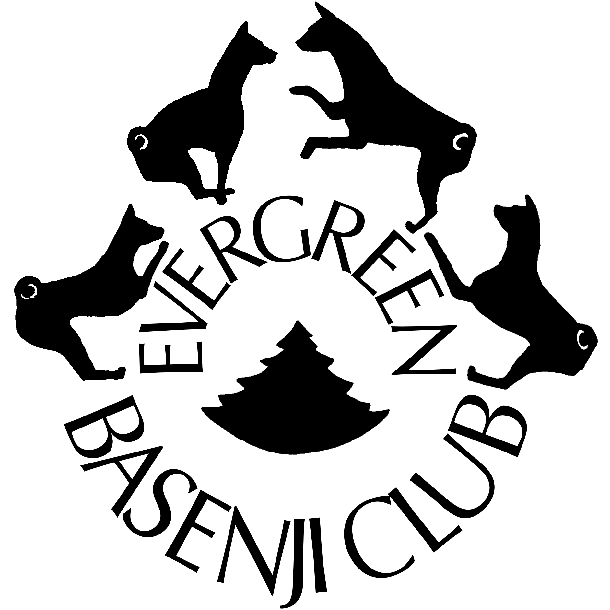
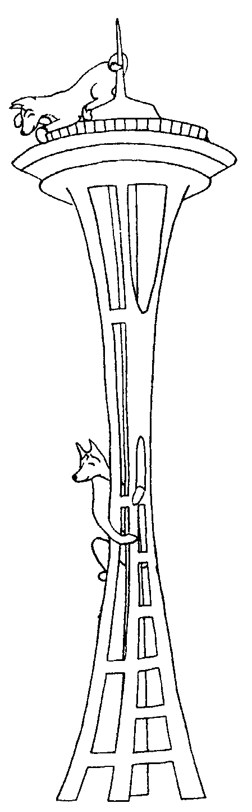

# About The Evergreen Basenji Club

The \index{Evergreen Basenji Club}Evergreen Basenji Club, founded in 1964, is the oldest existing local Basenji Club affiliated with the Basenji Club of America.  Its membership consists of basenji breeders, owners, and fanciers from the greater Seattle area.  You are cordially invited to become acquainted with the club and its activities.

The objectives of the Evergreen Basenji Club include:

1. to encourage the selective \index{breeding}breeding of purebred Basenjis to preserve there natural qualities and to conform to the \index{AKC}AKC \index{standard, AKC}standard for the breed.

2. to encourage and promote training and showing of Basenjis.

3. to encourage sportsmanlike competition at dog shows, obedience trials, and lure trials.

4. to conduct \index{AKC}AKC sanctioned \index{specialty}specialty shows and ASFA & AKC sanctioned lure trials.

5. to encourage participation of breeders and nonbreeders in club activities, to disseminate information and conduct educational programs, and to assist members with their problems in connection with the breed.

In addition, the club and its meetings encourage interchange of ideas and information, provide the opportunity for camaraderie, fellowship, and friendship among members and basenji fanciers.

Evergreen Basenji Club meetings are held usually on the 3rd Friday of each month.  At time of this printing, the meeting place is the Lake City Community Center in Seattle (or contact a club member to verify current location). A business meeting is followed by a fun and/or informative program, refreshments, and fellowship.  Meetings are always open to guests and fellow basenji fanciers.  For information on upcoming meetings, ask your breeder.

Foremost among its many activities the EBC hosts is the annual \index{EBC!Specialty}Specialty Show, Lure Trial, and Futurity in August.  The Specialty is an all Basenji conformation show, which also includes non-regular classes such as \index{veteran}Veteran, \index{stud dog}Stud Dog, \index{brood bitch}Brood Bitch, Team and \index{brace}Brace.  The Lure Trial is also just for basenjis. The \index{futurity}Futurity, unique to the EBC, is a puppy 'sweepstakes': a dam is nominated for the Futurity before her puppies are whelped; then puppies are individually nominated before 3 months of age and again before 5 months.  Only nominated pups may be finally entered in the Futurity classes at the Specialty.  Proceeds from nomination and entry fees are split into cash prizes for winners of the classes and Best in Futurity.  Check with your breeder to see if your puppy is Futurity-nominated!

In anticipation of this August \index{EBC!Specialty}Specialty, the EBC conducts informal puppy training classes, beginning with good weather in the spring each year. These classes are taught by showing members of the club. Any and all basenjis and their owners---novice or experienced---are welcome to join in the fun and experience.  Handlers, as well as puppies, learn ring procedure, training and handling techniques.

EBC has a dedicated lure coursing contingent.  The club sponsors several \index{AKC}AKC & \index{ASFA}ASFA trials each year.

To assist members and any interested basenji fanciers in training their puppies and conditioning their experienced dogs for lure coursing, the EBC holds informal lure practice runs, beginning with good weather in the spring.  These practices are open to all basenjis.  Members assist novices in handling their dogs at the course, training and conditioning at home, introducing beginners to chase the lure, use of the \index{muzzle}muzzle, and progression to running with other dogs.

The EBC also sponsors All Breed Fun Matches. These are "practice" shows; no points towards championships or titles are awarded.  They are for fun and experience for handlers and dogs alike. Matches provide the opportunity to show just for fun and to gain ring experience both in conformation and/or obedience. They also provide the opportunity to learn how a dog show works and to learn and assist in the various aspects of running a dog show, such as taking entries, ring set up, ring stewarding, etc.

To recognize achievements of members and their basenjis, the EBC offers award certificates for the preceding year, such as: \index{championship}Championship, Obedience Title, \index{lure coursing}Lure \index{field champion}Field Championship, National Honor Roll---\index{stud dog}Stud Dog or \index{brood bitch}Brood Bitch, Top Ten placement, Top Junior Showman---Novice and Open, Best in Show, Best in Field, High in Trial, Sportsmanship

These are awarded at an Awards Banquet held in March.  Guests, as always, are welcome to come and honor the newest champions and their proud owners.

Among its social activities, the club has an annual Halloween party and a Christmas Potluck with gift exchange. Occasionally, members and friends get together with their basenjis for an informal Play Day, featuring races, contests, and games for basenjis and their handlers, along with a Gourmet Potluck.

Friends, guests and basenji fanciers are welcome at all EBC activities and meetings.  Come join the fun, meet other fanciers and their basenjis, and introduce us to your basenji!

## The Evergreen Basenji Club \index{EBC!Code of Ethics}Code of Ethics

_I will encourage a high standard of sportsmanship by my behavior and will not engage in malicious or intentionally misleading or exaggerated statements about other breeders, their dogs or \index{breeding}breeding practices._

_I will help educate the public in the standard and care of the breed._

_I will maintain high standards in the care of my dogs._

_I will comply with all \index{AKC}AKC rules and regulations where they pertain, and will not use dogs for \index{breeding}breeding purposes that are not AKC registrable._

_I will accept the \index{AKC}AKC Basenji \index{Standard, Basenji}Standard as the ideal towards which to direct all \index{breeding}breeding activities._

_No dog that I sell shall be \index{AKC}AKC registered unless it has, in my opinion, sufficient quality and soundness of temperament to be used for \index{breeding}breeding.  Otherwise, I will offer limited registration or the dog shall be, or has been, sexually altered._

_I will not sell dogs without true and full representation, nor willfully conceal known genetic \index{faults}faults nor intentionally use misleading or untruthful statements in selling and advertising._

_I will not sell or donate dogs to commercial dog wholesalers or pet shops._

_I will help the purchaser in every reasonable way for the life of the dog._

_I understand that indiscriminate \index{breeding}breeding may lead to overpopulation and contribute materially to the deterioration of the breed._

