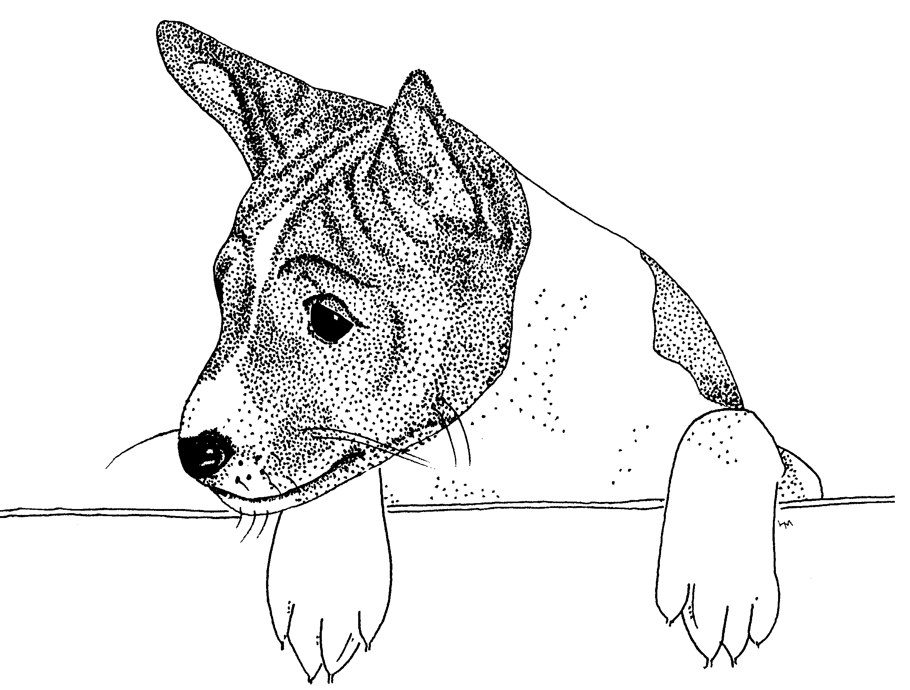

# Introduction

We are concerned for all dogs in general and the welfare of the Basenji in particular.  We wish to promote Responsible Pet Ownership through education and support.  When you buy a basenji, or any dog, you are making a 10 to 15 year commitment.

You have taken the best first step by buying your puppy from a responsible breeder.  This manual is a collection of articles designed to give you, the basenji owner, information and guidelines about the breed, its characteristics, care, and training, as well as information about activities you and your basenji can become involved in.

Raising a puppy to be a valued member of your family is rewarding, but at times can be very challenging and frustrating. If you have any questions or problems concerning your puppy, his behavior, or training, do not hesi-tate to call your breeder or one of the resource persons your breeder has listed.

### Resource people to call if you have any questions or problems

_(wrong image, correct one missing?)_

