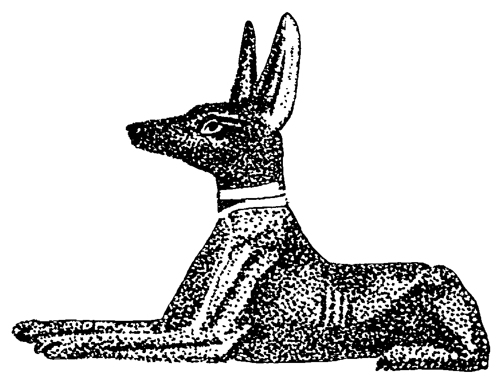
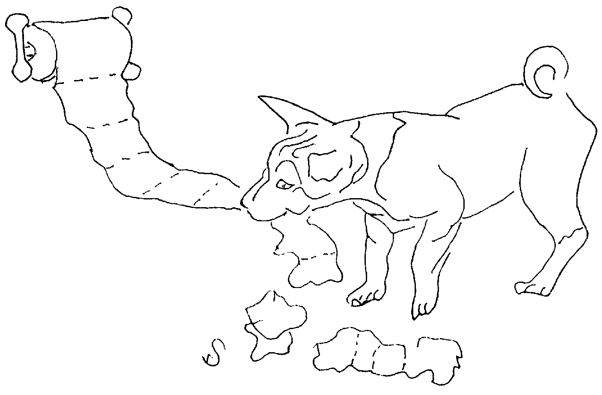

# About Your Basenji

## AKC REGISTRATION

The American Kennel Club was founded on September 17, 1884, as an independent, nonprofit organization devoted to the advancement and welfare of purebred dogs.  AKC is the principal registry agency for purebred dogs in the United States.

When you buy a dog represented as AKC registrable, you should receive an AKC dog Registration Application form properly filled out by the seller or, a bill of sale listing: the names and registration numbers of the sire and dam, date of birth, breeder and seller, with an agreement to provide the registration paper at a later date.  The application, when completed by you and submitted to AKC with the proper fee, will enable you to register the dog.  When the application has been processed, you will receive an AKC Registration Certificate.  Other conditions and agreement of sale should be in writing, signed by both seller and buyer with a signed copy provided to the buyer.

There is a widely held belief that "AKC" or "AKC papers" and quality are one and the same. This is not the case.  AKC is only a registry body. A registration certificate identifies the dog as the offspring of a known sire and dam, born on a known date.  It in no way indicates the quality or state of health of the dog.

Quality in the sense of "show quality" is determined by many factors including the dog's health, physical condition, ability to move and appearance. Breeders breeding show stock are trying to produce animals that closely resemble the description of perfection described in the breed standard.  Many people breed their dogs with no concern for the qualitative demands of the breed standard.  When this occurs repeatedly over several generations, the animals, while still purebred, can be of extremely low quality.

## AKC REGISTRATION, NEW ARRIVALS

In the late 1980's several African Basenji dogs were imported into the United States, 14 of which were accepted into the AKC registry.   Some of these were a new "Brindle" or tiger-striped color (black stripes over a red coat).  In 1990 the AKC also approved a new Basenji Standard, which among other things, recognizes this new coat color (see Basenji Standard later in this chapter)

This has some historical significance since the AKC rarely opens its studbook.  There is much interesting reading to be found about this event in the BCOA & periodicals (See Bibliography).  The novice fancier is encouraged to become more informed about the reasons for, and the processes & discussions surrounding this event.

## AN INTRODUCTION TO THE BASENJI

The dogs of the stone age were small foxy fellows, who gathered around the first campfires.  As ancient man went from place to place about his business, they followed at a respectful distance... probably attracted by occasional handouts, possibly because they felt an affinity to him.  The first dogs, according to paleontologists, were very like basenjis, and there are scientific reasons for supposing that the Basenji was this "Canis Palustrus" of prehistoric times.

The Basenji made an appearance in civilization at the dawn of history.  Brought down the Nile as tribute by people from Central Africa, he was a palace dog of the pharaohs so long ago that he watched the pyramids being built.  Pictured in bas-relief and sculptured in stone as far back as 4000 BC, the Basenji is shown both as a hunter and as a favored house pet lying under the pharaoh's chair.  He was found in Mesopotamia many centuries later.  The Metropolitan Museum of Art owns a bronze statue of a man and a Basenji-like dog, including curled tail and wrinkled forehead.  This is identified as Babylonian, 1500 BC.  Ancient empires, crumbling, disappeared along with the Basenji, and without a trace.  Only as recently as the latter half of the 19th Century was he rediscovered in his original habitat---the headwaters of both the Nile and the Congo---in the heart of Africa.  There, basenjis are still hunting dogs of native tribes, and so necessary are they to the Pygmies that a wife can be purchased for less than a basenji.

English nobility rediscovered these little dogs during their hunting expeditions.  For fifty years, the British made many attempts to bring basenjis to England, but they were not successfully acclimated there until 1937.  At the same time, a pair was brought to America.

The Basenji does not bark.  This unusual characteristic does not seem too unusual when you remember that original canines---wolves, coyotes, and jackals---don't bark, either.  Since the Basenji is silent on the trail, the Congolese, as did the ancients, required him to wear a hunting bell so they could trail him.  Though he doesn't "BOW-WOW-WOW," the Basenji is not mute, and can make all the other sounds dogs make: growls, whines, yips, and howls.  He has in addition an unusual sound called a "yodel!" that he uses when he is happy.

Sleek short coat, pricked ears, and a curly tail are Basenji trademarks.  Wrinkles appear on the forehead, giving a questioning look; however, he actually knows all the answers.  An elegant, deer-like little fellow, he averages 16--17 inches in height at the shoulders and 21 to 25 pounds in weight.  Color-coded red, black, black with tan trimming (tricolor) or brindle, he always has white on the feet, chest, and tail tip.  Some have more white than others, sometimes with a blaze on the face, full collar, and full white legs.  His short coat is unique in that it has no doggy odor, and he keeps immaculate without being bathed for months.

The Basenji is happy to fit his mood to those he loves---yet he is a proud dog always, not bowing and scraping.  He is a staunch believer in personal and property rights.  The silent hunter is also a silent watch dog.  A sound outside brings him noiselessly to the door, to await an intruder.  He will give the house-breaker a rough time.  Owners will testify to his phenomenal intelligence, his inventiveness, his curiosity, and his clownish sense of humor.  He is a quiet, satisfied dog when desired.  Yet no dog enjoys play more, whether in the home or the field.  He will roughhouse and race. However, when his owner is ready to call it quits, the little Basenji is content to lie at the feet of his master just as his forebears did thousands of years ago in the courts of Ancient Egypt, his wrinkled forehead imparting an anxious expression to his face---the look of one who, having known man from the beginning, is terribly worried about the outcome. _**Have fun and enjoy your new pet!**_

## CHARACTERISTIC BASENJI BEHAVIOR

Hi, my name is Lady.  Being a basenji, the EBC asked me to write an article about what basenjis are really like.  The first thing you should know is that each one of us has our own personality.  Yet, we share many unique characteristics.

You may have read the story about when God created all the animals he had a little piece of each one left over so he put all these pieces in one package and called it a Basenji.  That is why at times we have qualities of the dog, cat, fox, deer, horse, mule, gazelle, kangaroo, and unicorn (oh, but you wouldn't know about that one), and any other animal you can think of.

Most of us are pretty smart, although not in the way some humans appreciate.  Our unique combination of intelligence & independence makes us a challenge to live with on occasion.  When we see an opportunity, we will take advantage of it.

We are known as both sight and scent hounds; however, we can be selectively hard of hearing and blind!  We sometimes love to ignore being called.

Some of my favorite pastimes are napping by the heat vent or in front of the fire.  Licking my human dry after her bath.  I love to roll in hair (preferably freshly shampooed).  My greeting to many guests is to climb up beside them and roll in their hair---kind of unnerving to some people.

I like to sing & yodel & dance when my favorite humans visit the house.  Raiding the wastebasket,

Shredding Kleenex or unrolling TP down the hall.  Rolling on a wet towel or shredded Kleenex.  Q-tips are my favorite popsicle!  However, a pair of underwear will do nicely for dessert.  I like to use my paws to explore & play or to clean my face when dirty.

I love to run free and chase rabbits, squirrels and birds out of my yard, and occasionally, I catch a few.

I like to do my crazy dog routine---this is where I race through the house at full speed, bouncing off the couch, flying off the walls, and across the bed in a big loop over and over until I get tired.  Then I will stop, panting with a big smile on my face.  "Going on a tear" at the end of my leash, around and around until I fly off the ground.

Cleaning up under the high chair after my kid eats.  I clean up under birdcages persistently. Seed shells are almost as good as the actual seeds.

It isn't unusual for me to take an interest in other animals' poop, possibly rolling in it or sampling a taste.  I love to nibble rabbit droppings, perhaps in lieu of the actual rabbit, but I hear they say that rabbits can pass parasites to me.

Baby diapers.  Oooh do I love baby diapers!!

I heard someone say basenjis like to sleep on the foot of the bed.  HA!---I prefer under the covers.  If that's not possible, then up by the head of my human.  When my master or mistress grabs a quilt or afghan or comfy throw, I run to get under too.

I love to snuggle and be scratched and I am happiest where the action is.

I like to check out the window to see what the weather is like before I go outside in the morning. If it's raining, I'd rather wait hours than to venture out and get my feet wet.  I resemble a ballet dancer when in wet grass, yet a few of my kin actually like to swim.  Snow can be fun though.

Although I don't normally bark, I can make a wide variety of noises from cute little yodels to loud screams and howls.  I can even sound like a little kid crying & screaming.  Sometimes my human and neighbors are not very happy with my noisemaking. And do I love to chew! (see chewing section page 20).

Some of my kin have masters who don't permit some of these antics.  They hide waste paper baskets and close doors.  They have taught my kin to stay off the furniture and to sleep in dog beds or a den at night.

Now that you know me a little better, I hope you'll find my antics endlessly amusing.  I try to be entertaining.

...Love, Lady.  

## BASENJI STANDARD

**(AKC approved 1990)**

_**General Appearance**_---The Basenji is a small, short haired hunting dog from Africa.  It is short backed and lightly built, appearing high on the leg compared to its length.  The wrinkled head is proudly carried on a well arched neck and the tail is set high and curled.  Elegant and graceful, the whole demeanor is one of poise and inquiring alertness.  The balanced structure and the smooth musculature enables it to move with ease and agility.  The Basenji hunts by both sight and scent.  **Characteristics**--- The Basenji should not bark but is not mute.  The wrinkled forehead, tightly curled tail and swift, effortless gait (resembling a racehorse trotting full out) are typical of the breed.  **Faults**---Any departure from the following points must be considered a fault, and the seriousness with which the fault is regarded is to be in exact proportion to its degree.

_**Size Proportion, Substance**_---Ideal height for dogs is 17 inches and bitches 16 inches.  Dogs 17 inches and bitches 16 inches from front of chest to point of buttocks.  Approximate weight for dogs, 24 pounds, and bitches 22 pounds.  Lightly built within this height to weight ratio.

_**Head**_---The head is proudly carried.  **Eyes**---Dark hazel to dark brown, almond shaped, obliquely set and farseeing, rims dark.  **Ears**---Small, erect and slightly hooded, of fine texture and set well forward on top of head.  The skull is flat, well chiseled and of medium width, tapering toward the eyes.  The foreface tapers from eye to muzzle with a perceptible stop.  Muzzle shorter than skull, neither coarse nor snipy, but with rounded cushions.  Wrinkles appear upon the forehead when ears are erect, and are fine and profuse.  Side wrinkles are desirable, but should never be exaggerated into dewlap.  Wrinkles are most noticeable in puppies, and because of lack of shadowing, less noticeable in blacks, tricolors and brindles.  **Nose**---Black greatly desired.  **Teeth**---Evenly aligned with a scissors bite.

_**Neck, Topline, Body**_---Neck of good length, well crested and slightly full at base of throat, well set into shoulders.  **Topline**---Back level.  **Body**---Balanced with a short back, short coupled and ending in a definite waist.  Ribs moderately sprung, deep to elbows and oval.  Slight forechest in front of point of shoulder. Chest of medium width.  Tail is set high on topline, bends acutely forward and lies well curled over either side.

_**Forequarters**_---Shoulders moderately laid back. Shoulder blade and upper arm of approximately equal length.  Elbows tucked firmly against brisket.  Legs straight with clean fine bone, long forearm and well-defined sinews.  Pasterns of good length, strong and flexible, **Feet**---Small, oval and compact with thick pads and well arched toes.  Dewclaws are usually removed.

_**Hindquarters**_---Medium width, strong and muscular, hocks well let down and turned neither in nor out, with long second thighs and moderately bent stifles.  **Feet**---Same as in "Forequarters".

_**Coat and Color**_---Coat short and fine.  Skin very pliant.  **Color**---Chestnut red; pure black; tricolor (pure black and chestnut red); or brindle (black stripes on a background of chestnut red); all with white feet, amount of white should never predominate over primary color.  Color and markings should be rich, clear and well-defined, with a distinct line of demarcation between the black and red of tricolors and the stripes on brindles.

_**Gait**_---Swift, tireless trot.  Stride is long, smooth, effortless and the topline remains level.  Coming and going, the straight column of bones from shoulder joint to foot and from hip joint to pad remains unbroken, converging toward the centerline under the body. The faster the trot, the greater the convergence.

_**Temperament**_---An intelligent, independent, but affectionate and alert breed.  Can be aloof with strangers.
